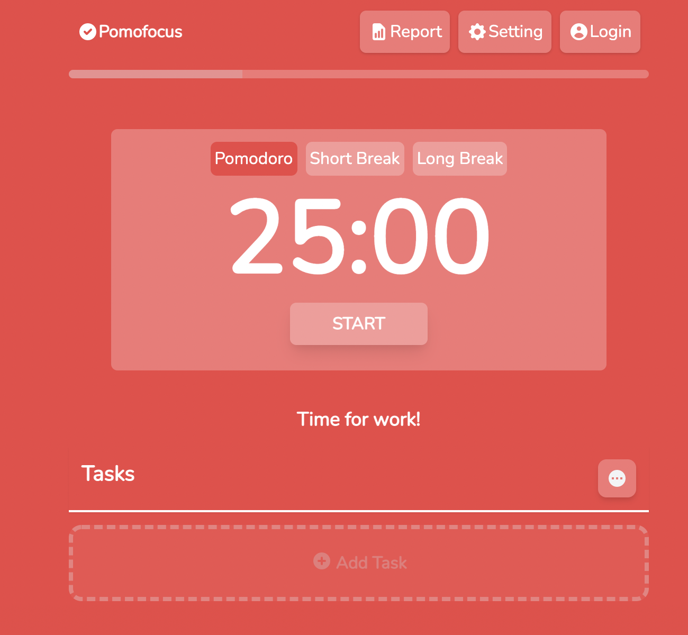
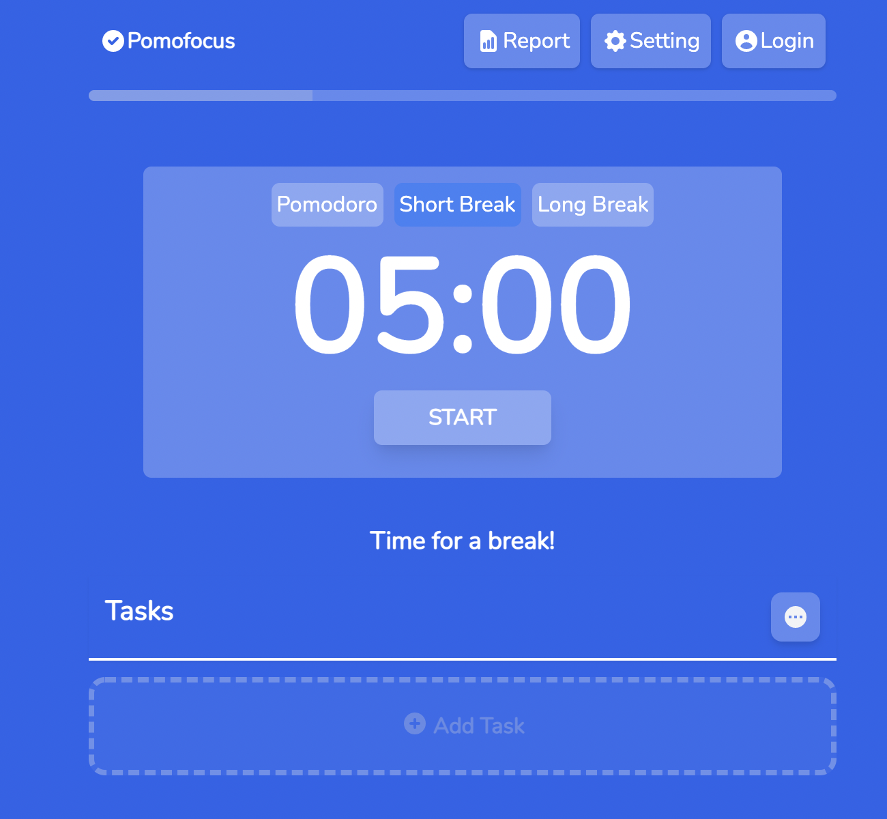
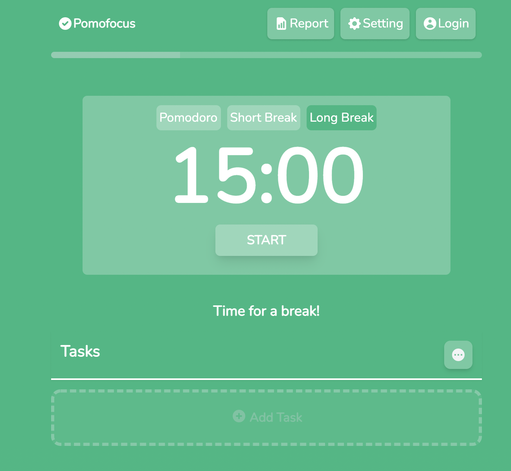

# Pomofocus-clone
[Pomofocus](https://pomofocus.io/) is the site I frequently use. 

Made a copy of it with [TailwindCSS](https://tailwindcss.com/) and [Heroicons](https://heroicons.com/)

<figure>
  <figcaption>Pomodoro</figcaption>
  
</figure>

<figure>
  <figcaption>Short Break </figcaption>
  
</figure
  
<figure>
  <figcaption>Long Break </figcaption>
  
</figure>
